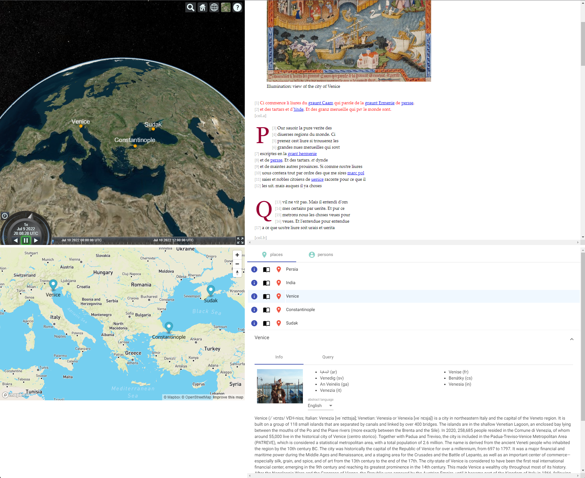

# SummerGlobe

- [SummerGlobe](#summerglobe)
  - [Docker](#docker)
  - [Note](#note)
  - [Concept](#concept)
  - [History](#history)
    - [0.0.3](#003)
    - [0.0.2](#002)

This project was generated with [Angular CLI](https://github.com/angular/angular-cli) version 13.2.6.

VeDPH Summer School 2022 proof of concept web app.



## Docker

Building image:

1. ensure to set the right _access tokens_ for Mapbox and Cesium in `environment.ts`.
2. `ng build`.
3. generate the image:

```bash
docker build . -t vedph2020/summer-globe:0.0.3 -t vedph2020/summer-globe:latest
```

To use the image you can create a new `docker-compose.yml` file, paste the following content into it, and save it somewhere on your computer. Then, just open a terminal in its folder and run `docker compose up` (or `docker-compose up` if you are using the old composer). You will find the app with your browser at `http://localhost:4200`.

```yml
version: '3.7'
services:
  summer-globe:
    image: vedph2020/summer-globe:0.0.3
    ports:
      - 4200:80
```

Deployment notice: the version of this script modified for its temporary hosting environment is here:

```yml
version: '3.7'
services:
  globe-app:
    image: vedph2020/summer-globe:0.0.3
    ports:
      - 4202:80
    environment:
      - VIRTUAL_HOST=globe.fusi-soft.com
      - LETSENCRYPT_HOST=globe.fusi-soft.com
      - LETSENCRYPT_EMAIL=fusi.daniele@tiscali.it

networks:
  default:
    external: true
    name: nginx-proxy
```

## Note

IMPORTANT: before you can run this app, you **must** provide two API tokens from your own accounts: one for [Mapbox](https://docs.mapbox.com/help/getting-started/access-tokens/), and another for the [Cesium](https://cesium.com/learn/ion/cesium-ion-access-tokens/) globe.

These tokens are specified in `src/environments/environment.ts`. Just fill in the empty strings the tokens, and you are ready to go.

## Concept

The idea is attaching to the typical students flow, which in the context of the textual strand should lead them to build a simple TEI document, with some text derived from the globe and eventually attached to places or persons. So, in this school flow we start with TEI and end up transforming it into HTML + CSS via XSLT. This provides students with a real-world demonstration of the typical set of technologies used in this context.

At this point, we'd like to introduce the very basics of databases and semantic web; we can easily derive the latter from the former, and place this in the scenario of the changing web (simplifying a lot, web 1 was a network of hypertexts for humans; web 2 is a network of applications and services; web 3 will be a network of data, directly published to the consumer, which is software acting on behalf of users).

Given that it's very difficult to present LOD in a few minutes, probably here too a more effective approach can be provided by a real-world application of its essential principles. We could just let students add another layer of TEI annotations, just including DBPedia URIs; and then let them look at some magic where their data get presented to end users in a highly interactive way, enriched with a fully browsable 3D globe, a fully browsable 2D map, their rendered text, and the list of places and persons derived from it.

The entry point to this app is an XSLT script used to generate HTML output. This among other things will produce a link for each annotated place or person in the text. The rendering process here adopts a convention by which any relevant entity must be encoded as an `a` element, whose `href` attribute starts with `t:` for toponyms or `a:` for anthroponyms, followed by a label, `:`, and the DBPedia URI of the entity, e.g.:

```html
<a href="a:Crates:http://dbpedia.org/resource/Crates_of_Mallus">Crates of Mallus</a>
```

That's of course very raw, as we need to keep everything as simple as possible, but it's enough to build an application on top of it: a web application which can emphasize these concepts:

- showing how all the technologies they were introduced to work together: HTML, CSS, XML, TEI, XSLT, LOD.
- building on top of structured data (here TEI texts).
- publishing data as software (applications backed by services).
- leveraging the power of LOD to fetch data from SPARQL endpoints around the web. In our case, we will use DBPedia, the LOD counterpart of Wikipedia.
- showing how the software will act on behalf of human users in dealing with queries to the semantic web.

The dummy app presented here does this by first importing the output of the students flow, i.e. their HTML text as generated by XSLT from XML. Of course, XSLT too will be provided ready to use; they will just have to build some TEI from the globe, or enrich or augment an existing TEI skeleton from it.

>You can find a sample of the XSLT used by a previous sample app of mine under `legacy-transform.zip`. Most of its templates can probably be reused for this project.

Once HTML is imported, it is displayed and scanned for links (anchors). As you know, links here are the outcome of LOD annotations, so that each of them carries the entity ID in the form of its URI, prefixed by `t:`/`a:` for toponyms or anthroponyms.

The app thus builds its list of LOD entities. Then, some magic happens: it supplies location data by querying DBPedia. Users just added the DBPedia URI, and nothing more. The app queries the DBPedia SPARQL endpoint and fetches additional metadata about each entity: names in different languages (which should emphasize the concept that LOD deals with entities rather than with their names, as for the traditional web), description, geographic location when applicable, descriptive image, etc.

So the end user will be able to browse all the places and persons which were annotated on the text, by simply looking at these lists, and getting more details about each by clicking. These details also come with the SPARQL code used to query the endpoint, so that they can have some feeling of what is going on.

Also, we want to emphasize the fact that a digital publication is not just taking a text and placing it in a different medium. Talking about modeling and all the stuff you know me would take a lot of time; but here we are lucky enough to be able to show something fancy, as after all we have a globe. So, we can add a couple of highly interactive and powerful resources connected to the world of GIS (which in turn is probably something archaeologists might talk about):

- a fully interactive 3D spinning globe, from [Cesium](https://cesium.com/).
- a fully interactive 2D map, from [MapBox](https://www.mapbox.com/).

So, not only the places extracted from the text annotations are listed here and enriched with position and other information: they are also shown on the globe, and on the map. Users are free to explore, spin, zoom in and out, and see how their text takes life in the context of a digital product.

## History

### 0.0.3

- 2022-07-09:
  - refactored to use ms text instead of sample text.
  - added `tei` folder with TEI text and its transform script (just for reference).
  - swap lat/long in mapboxgl `flyTo`.
  - made `dbp:title` optional in person query, otherwise persons like Marco Polo were no more found.
  - added link to open the [DBPedia SPARQL endpoint](https://dbpedia.org/sparql) in query pane.

### 0.0.2

- 2022-07-06: updated Angular.
- 2022-06-20: upgraded to Angular 14.
